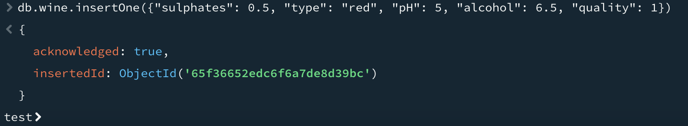

# Домашнее задание №1. Знакомство с MongoDB
## Установка MongoDB
Ранее, ещё до установки Mongo, у меня был установлен на компьютере Docker и docker-compose, которыми я пользовался раньше, поэтому устанавливать Mongo я решил именно в виде Docker-контейнера. Для этого я написал соответствующий docker-compose.yml файл и создал нужый docker-контейнер командой:
```
$ docker-compose up --build -d
```
Также, помимо самого контейнера с Mongo я скачал с [официального сайта](https://www.mongodb.com/products/tools/compass) и установил программу Compass для более удобного взаимодействия с СУБД MongoDB.

## Создание базы данных, коллекции и наполнение данными
Создаём новую коллекцию командой:
```
> use test
> db.createCollection('wine')
```
Для наполнения коллекции данными я выбрал дамп с этого [сайта](https://archive.ics.uci.edu/dataset/186/wine+quality). Этот дамп содержит информацию о разных винах с 13 параметрами. (Выбрал я его, так как в нём содержится больше всего столбцов по сравнению со всеми, которые я ещё изучил)
Затем, с помощью Compass я импортировал все данные дампа из csv файла в созданную коллекцию. И на выходе получаем такую картину с базой данных из Compass:


## CRUD-запросы
### findOne
Далее я приступил к написанию различных CRUD-запросов. Начал я с функции findOne:


### findMany
Далее я перешёл к функции find и заодно решил измерить время выполенения команды c помощью explain("executionStats"):
```
> db.wine.find({"pH": {$lt: 2.75}}).explain("executionStats")
```


### insertOne
Выполняем insertOne:



### insertMany
Выполняем insertMany:


### UpdateOne
Выполняем updateOne:


### updateMany
Выполняем updateMany:


### deleteOne
Выполняем deleteOne:


### deleteMany
Выполняем deleteMany:


## Индексы
Теперь создадим индексы и проверим производительность запросов выборки:
```
> db.wine.createIndex({"pH": 1})
< pH_1
```
И попробуем повторить операцию выбрки find():


## Выводы
Как мы видим по результатам проделанных операций, запросы выборки с индексами происходят гораздо быстрее, чем без них. И вообще MongoDB оставил, скорее положительное мнение. Все базовые CRUD-операции обычной рСУБД тут есть, но при этом многие операции выполняются гораздо быстрее. И синтаксис гораздо удобнее, т.к. выборку можно сделать быстро, а не писать длинный SELECT...


