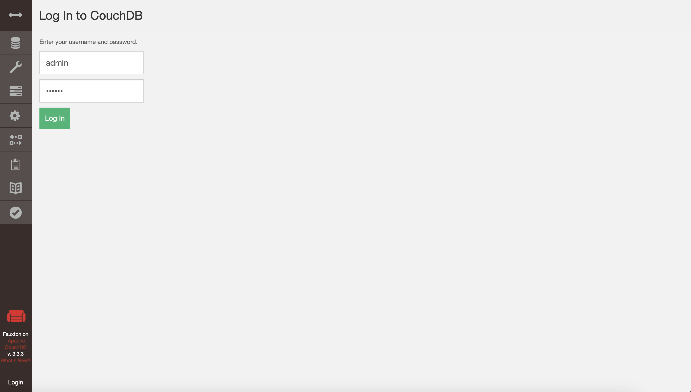
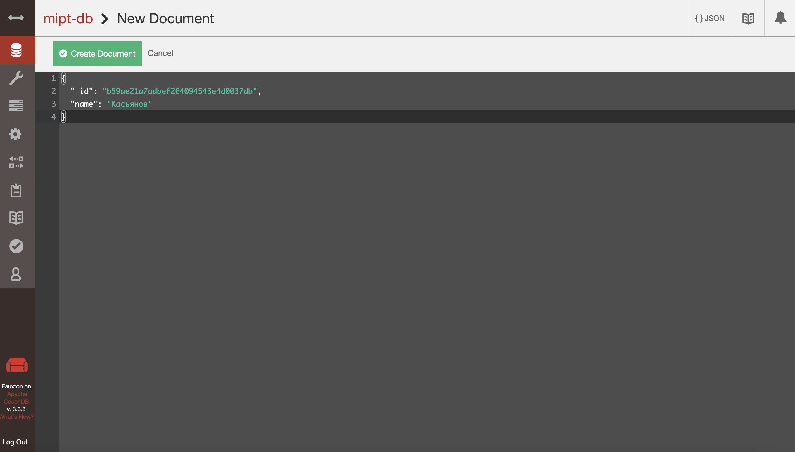
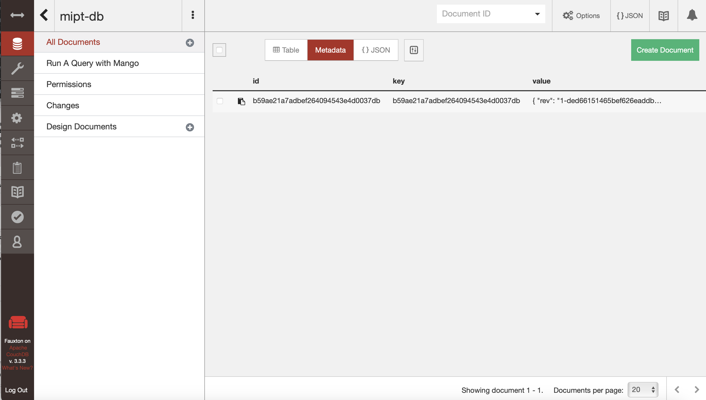
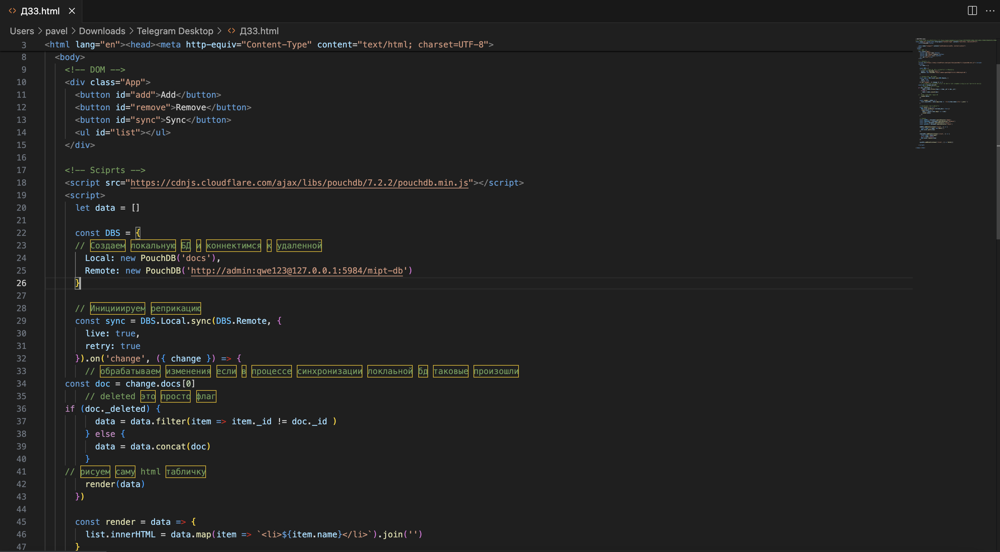
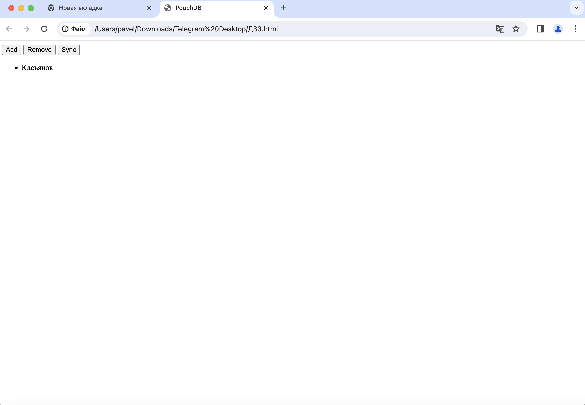

# Домашнее задание №3. CouchDB + PouchDB.
## Установка CouchDB
Скачиваем CouchDB с официального сайта и устанавливаем на компьютере. При запуске базы данных, система просит нас создать пароль для пользователя admin – создаём его.

## Создание базы данных
Переходим в браузере по адресу http://127.0.0.1:5984/_utils/ и проходим авторизацию под пользователем admin, которого мы только что создали:

Создаём новую базу данных и документ в ней, который содержит только поле "name" со значением "Касьянов":



## Настройка браузера
Чтобы открыть нужный html файл и выполнить подключение к бд, нам необходимо отключить в браузере проверку CORS, для этого мы можем запустить Google Chrome на MacOS через терминал:
```
open -n -a /Applications/Google\ Chrome.app/Contents/MacOS/Google\ Chrome --args --user-data-dir="/tmp/chrome_dev_test" --disable-web-security
```

## Открытие html-файла
Теперь открываем ДЗ3.html, предварительно поменяв в нём адрес бд на нужный, и нажимаем кнопку sync. 


Как мы видим, фамилия вывелась корректно.

## Остановка сервера CouchDB
Останавливаем сервер CouchDB, обновляем страницу в браузере и нажимаем кнопку sync:

Как мы видим, фамилия до сих пор корректно выводится на экран.

## Сохранение полученной html-страницы
Сохраняем в браузере полученную html-страницу и загружаем на github. Скачать файл можно по [ссылке](https://github.com/Pavelkas04/sbt_db/tree/main/image/ht3/Saved_html).
